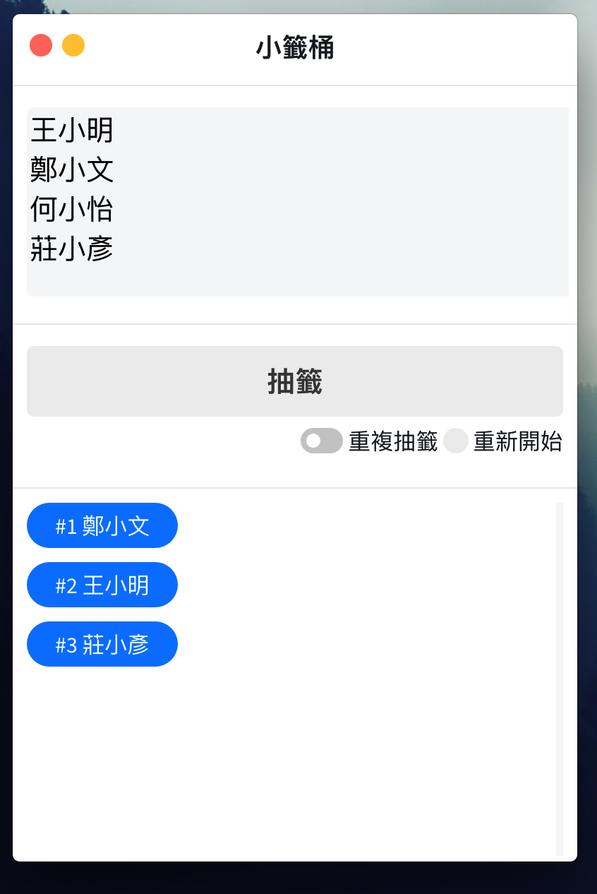

<p align="center"><a href="https://mike-zheng.github.io/posts/2d0e0212/" target="_blank" rel="noopener noreferrer"></a></p>

<p align="center">
  
  

</p>


> Notes: https://mike-zheng.github.io/posts/2d0e0212/

## Lab Lottery

- **Draw A Lottery** - An lottery desktop app written in Electron for NTU ICAN lab. 


--------------------------------------
## Installation & Develop

> jQuery & Electron

``` bash
npm install 

npm run start
```

--------------------------------------

## Download Link

https://github.com/Mike-Zheng/ICAN_Lottery/releases/tag/v1.0

## App Snapshot



